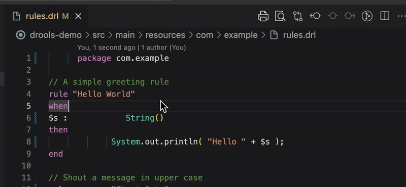

<p align="center">
  
</p>

Drools Formatter is VS Code extension that formats Drools (`.drl`) rule files.



## Support the creator

<a href="https://www.buymeacoffee.com/jhhtaylor" target="_blank"></a>

## Features

- Format the entire document with `Ctrl+Shift+I` or `Format Document` command.
- Format the selected lines with `Ctrl+K Ctrl+F` or `Format Selection`.

The formatter follows the basic layout in the Drools reference documentation. Lines
beginning with `rule`, rule attributes such as `dialect`, and `end` are flush
with the left margin. The `when` and `then` keywords also start at the left
margin, and their contents are indented four spaces. Blocks are closed with
`end` at column zero.

Only the main structural keywords (`rule`, `when`, `then`, `end`) affect
indentation. Other Drools keywords such as `accumulate`, `exists`, or `query`
are formatted as normal lines inside the blocks.

## Development

```
npm install
npm run watch

# For a single build
npm run compile
```

The compiled extension code is output to the `dist` folder.

## Usage

Open a `.drl` file in VS Code and use the standard formatting commands.
The extension registers the `drl` language, so `.drl` files are recognized automatically when the extension is installed.

## Disclaimer

This extension is an independent project and is not affiliated with or endorsed by the Drools project or Red Hat. The Drools name and logo are trademarks of their respective owners; use here is for identification purposes only.
