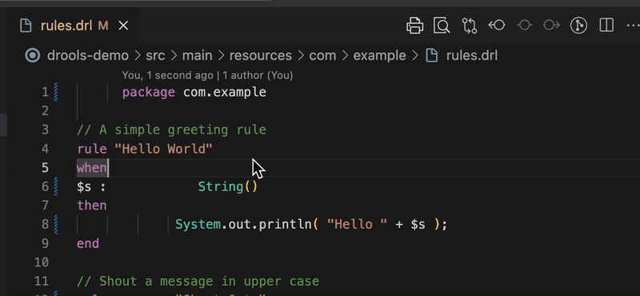

<p align="center">
  
</p>

Drools Formatter is VS Code extension that formats Drools (`.drl`) rule files.



## Support the creator

<a href="https://www.buymeacoffee.com/jhhtaylor" target="_blank"></a>

Love this extension? You can support its development with a small donation - completely optional! Your support helps me keep creating and improving tools like this.

## Features

- Format the entire document with `Ctrl+Shift+I` or `Format Document` command.
- Format the selected lines with `Ctrl+K Ctrl+F` or `Format Selection`.

The formatter follows the layout conventions in the
[Drools language reference](https://docs.drools.org/latest/drools-docs/drools/language-reference/index.html).
Top-level declarations (`package`, `unit`, `import`, `global`) stay at the left margin.
`rule`, `query`, `declare`, and `function` blocks are recognized, with their
contents indented based on your editor preferences—use tabs or select between
one and eight spaces.

Inside `when`/`query` blocks the formatter:

- Adds inner spaces to constraint parentheses: `Person( age >= 18 )`
- Normalizes operator spacing: `age>=18` becomes `age >= 18`
- Normalizes binding colons: `$p:Person()` becomes `$p : Person()`
- Ensures comma spacing: `age > 50,weight > 80` becomes `age > 50, weight > 80`
- Adds a space after DRL keywords: `not(X)` becomes `not (X)` (also `exists`, `forall`, `accumulate`, `collect`, `eval`)
- Indents continuation lines inside multi-line patterns

Inside `then` blocks:

- Action keywords (`update`, `insert`, `delete`, `retract`) use compact parens: `update($p);`
- `modify` blocks get inner spaces and proper brace indentation
- Constructor calls preserve compact parens: `new Alert("INFO", "msg")`
- Method chain continuations (`.filter()`, `.map()`, etc.) are indented
- Multi-line argument lists are indented to match their nesting depth

Comments (`//` and `/* */`) are indented but their content is never modified.
Consecutive blank lines are collapsed to one.

## Development

```
npm install
npm run watch

# For a single build
npm run compile
```

The compiled extension code is output to the `dist` folder.

## Usage

Open a `.drl` file in VS Code and use the standard formatting commands.
The extension registers the `drl` language, so `.drl` files are recognized automatically when the extension is installed.

## Disclaimer

This extension is an independent project and is not affiliated with or endorsed by the Drools project or Red Hat. The Drools name and logo are trademarks of their respective owners; use here is for identification purposes only.
